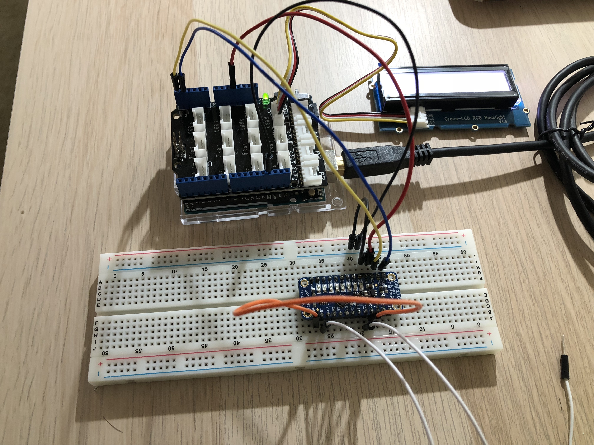
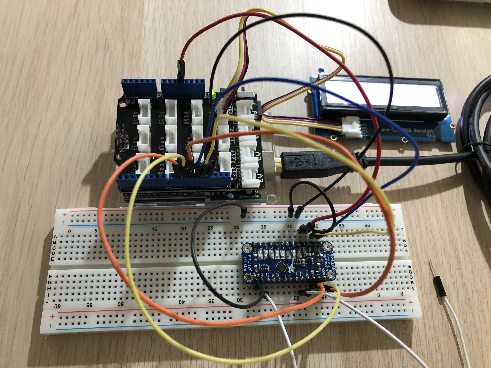

# CS244P IoT Demo 2

Using I2C and SPI to demo CAP1188 touch sensor.

As you can see, there are 2 program files for I2C and SPI wiring respectively. Please be aware that each time after uploading new code for different wiring, arduino should be completely off the power to reset itself for the new settings.

## Wiring for I2C

I2C needs 5 wires:

* SDA: A4
* SCK(SCL): A5
* 3Vo: AD (this wiring will fix I2C address to `0x28`)
* VIN: 5V
* GND

Also, you need to add wires for perceiving touch, from C1~8.

## Wiring for SPI

Though there're 2 types wiring for SPI, hardware and software, in terms of Arduino UNO, there's no different between them.

SPI needs 7 wires:

- SCK(SCL): D13
- MISO: D12
- MOSI: D11
- CS: D10
- RESET: D9
- VIN: 5V
- GND

Also, AD pin should be connected to GND as well.

